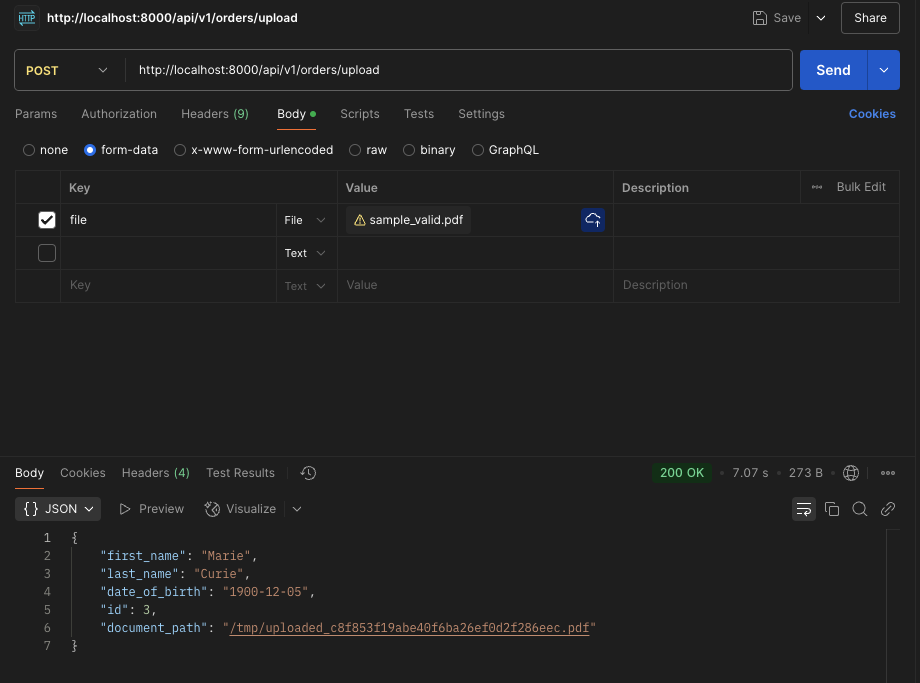
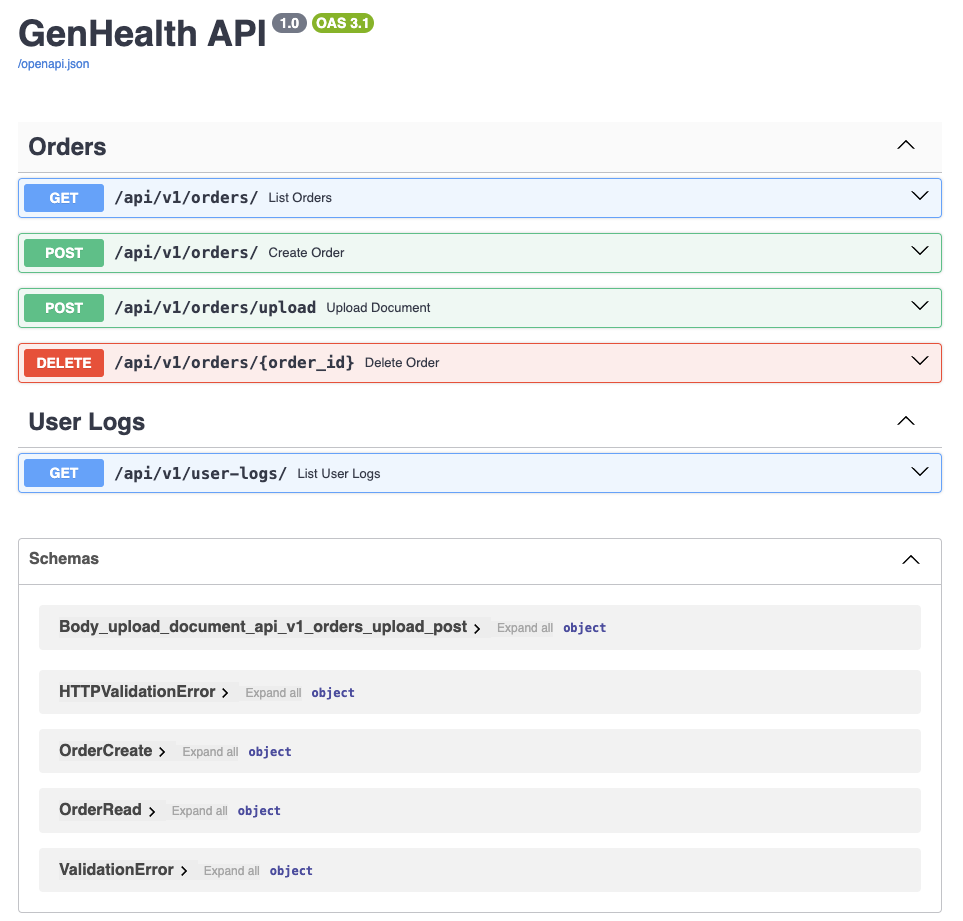

# OCR to API with Express.js and MCP

This project is a comprehensive backend service built with Express.js. It is a port of an original FastAPI application, designed to extract structured data from PDF documents, manage database records, and expose its functionality via both a standard REST API and the Model Context Protocol (MCP) for AI integration.

## Overview

The application is composed of two main parts that run concurrently:

1.  **Express.js REST API:** A robust API for performing CRUD operations on Orders and logging user activity. All endpoints are protected and require a bearer token.
2.  **MCP Server:** A protocol server that wraps the Express API, exposing its key features as callable "tools" for AI environments like Cursor.

## Features

- **PDF Processing:** Upload a PDF to extract structured data (first name, last name, date of birth) using OCR and an LLM.
- **Order Management:** Full CRUD (Create, Read, Update, Delete) functionality for Orders.
- **Request Logging:** Automatically logs all HTTP requests to a `user_logs` table for auditing.
- **Authentication:** API endpoints are protected via bearer token authentication.
- **Database:** Uses PostgreSQL with Sequelize as the ORM.
- **AI Integration:** Exposes API functionality as tools via the Model Context Protocol (MCP).

---

## Getting Started

This project is designed to be run with Node.js.

### Prerequisites

- **Node.js:** Version 20 or higher.
- **Ollama:** This app uses [Ollama](https://ollama.com) and the `phi` model to extract patient fields from unstructured OCR'd PDFs. Ensure Ollama is installed and the `phi` model is pulled (`ollama pull phi`). Make sure the service is running in the background (`ollama serve`).

### Installation and Running

1.  **Navigate to the app directory:**
    ```bash
    cd express-app
    ```

2.  **Install dependencies:**
    ```bash
    npm install
    ```

3.  **Start the application:**
    ```bash
    npm start
    ```
    This single command uses `concurrently` to launch both the Express API and the MCP server. You will see logs from both servers in your terminal.

---

## API Endpoints

The REST API is available for standard HTTP requests. **All endpoints require a valid Bearer Token in the `Authorization` header.**

- `GET /api/v1/orders/` – List all orders
- `POST /api/v1/orders/` – Create an order manually
- `PUT /api/v1/orders/:order_id` – Update an order
- `DELETE /api/v1/orders/:order_id` – Delete an order
- `POST /api/v1/orders/upload` – Upload a PDF to create an order
- `GET /api/v1/user-logs/` – List recent user request logs

---

## AI (MCP) Integration with Cursor

To connect the application's tools to an AI IDE like Cursor, you need to create a configuration file.

### 1. Create `mcp.json`

Create a file named `mcp.json` in the **root of the entire project repository**.

```json
{
  "mcpServers": {
    "express-app-mcp": {
      "command": "/absolute/path/to/node",
      "args": ["/absolute/path/to/your/project/express-app/mcp-server.js"],
      "env": {
        "PORT": "3000",
        "API_BEARER_TOKEN": "your-secret-token-here"
      }
    }
  }
}
```

### 2. Configure Paths and Token

You **must** replace the placeholder values:

- **`command` and `args`**: Use the absolute paths for your Node executable and the `mcp-server.js` script.
- **`API_BEARER_TOKEN`**: Replace `"your-secret-token-here"` with the actual bearer token required by the Express API's `authMiddleware`.

### 3. Use the Tools

With the `mcp.json` file configured and the application running (`npm start`), you can now securely use the following prompts in Cursor:

- `list all orders`
- `create an order from the pdf at /path/to/my-document.pdf`

---
## Screenshots

### 📤 Postman Upload Example


### 📚 Swagger `/docs`

